# Django OAuth Authentication

A simple Django project demonstrating OAuth authentication with Google. It includes a basic setup with the `social-auth-app-django` package, allowing users to log in using their Google accounts. A hands-on implementation for integrating OAuth in Django applications.

## Requirements

- Python 3.9
- Django 4.2
- `social-auth-app-django` for OAuth integration

## Installation

1. Clone the repository:

```bash
git clone https://github.com/Jonahida/django-oauth-authentication
cd django-oauth-authentication
```

2. Create a virtual environment using Python 3.9:

```bash
python3.9 -m venv env39
```

3. Activate the virtual environment:

On macOS/Linux:

```bash
source env39/bin/activate
```

On Windows:

```bash
env39\Scripts\activate
```

4.Install the required dependencies:

```bash
pip3 install -r requirements.txt
```


### Setup Google OAuth

To enable OAuth authentication using Google in your Django project, follow these steps:

1. **Create a Project in Google Developer Console:**
   - Go to the [Google Developer Console](https://console.cloud.google.com/projectcreate).
   - Click on **"Select a project"** at the top of the page, then click **"New Project"**.
   - Name your project and click **Create** to initialize the project.

   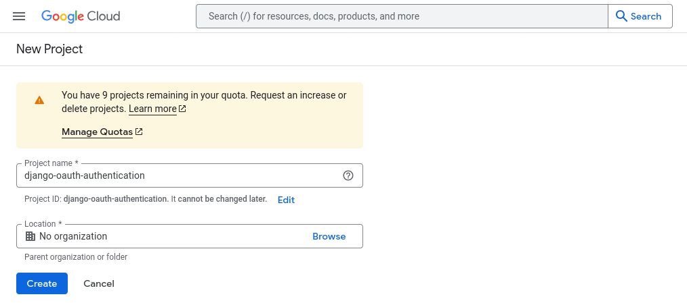

2. **Enable the Google API:**

   - Once your project is created, go to the **"Library"** section on the left sidebar of the Google Developer Console.

   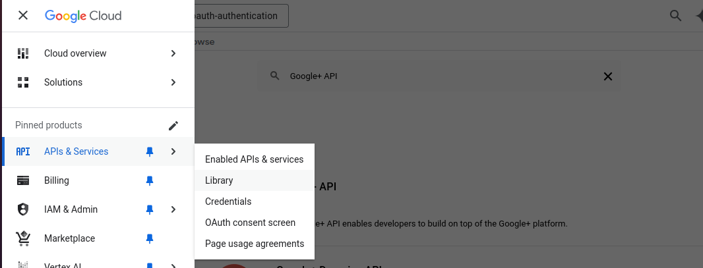

   - In the search bar, type **"Google+ API"** (or the API relevant to your OAuth needs) and click on it.

   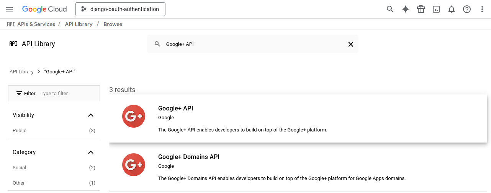


   - Click **Enable** to activate the API for your project.

   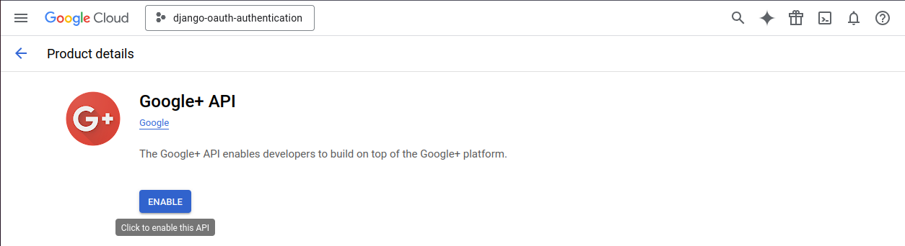


   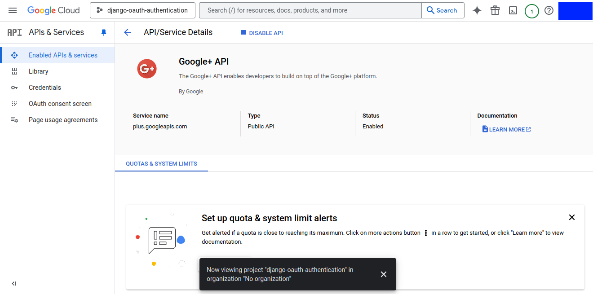

3. **Create OAuth 2.0 Credentials:**

   - In the sidebar, click on **"Credentials"**.

   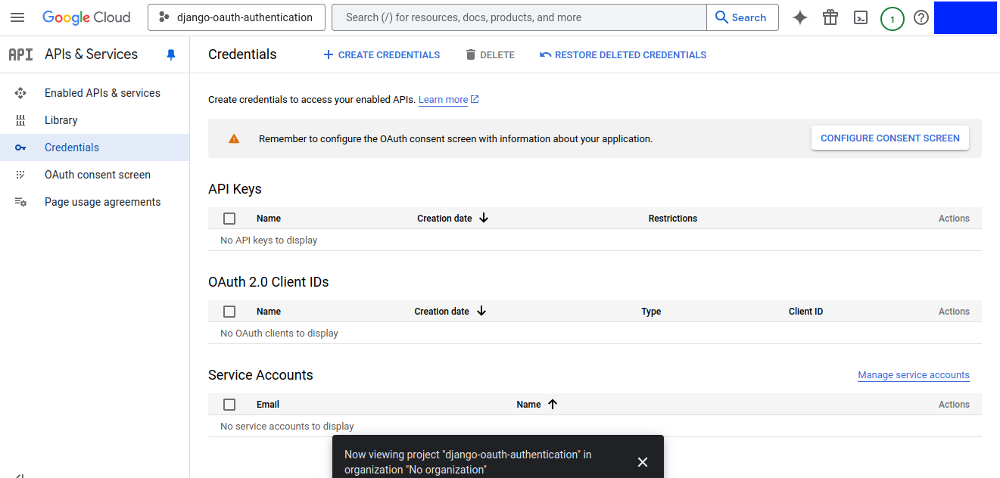

   - Click **Create Credentials** at the top and select **OAuth Client ID**.

   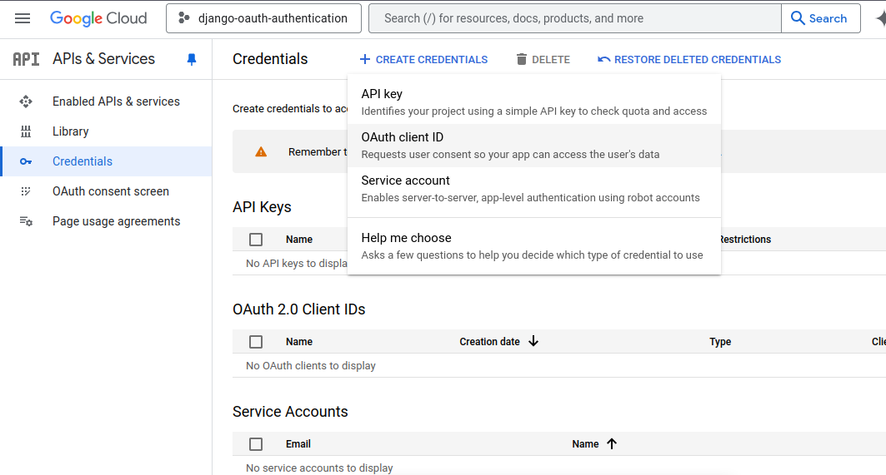


   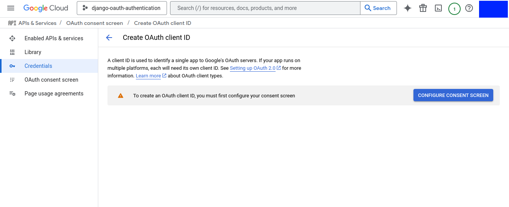

   - If prompted, configure the OAuth consent screen. In this case, I will click on **GO TO NEW EXPERIENCE** in order to configure **Google Auth Platform**.

   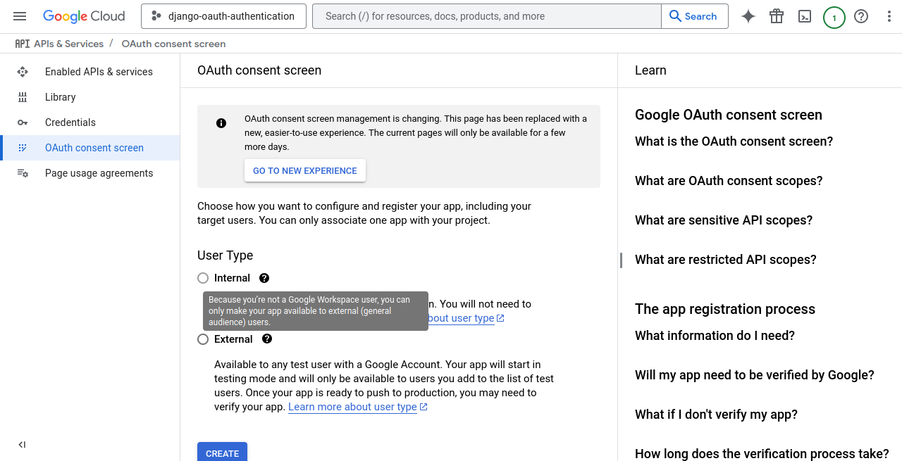


   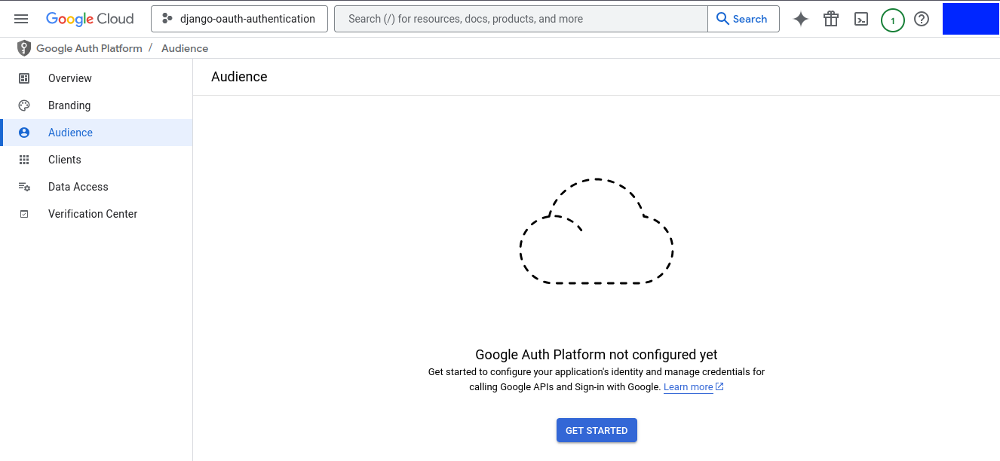


   - In the **App Information** section, add **App name** and **User support email**.

   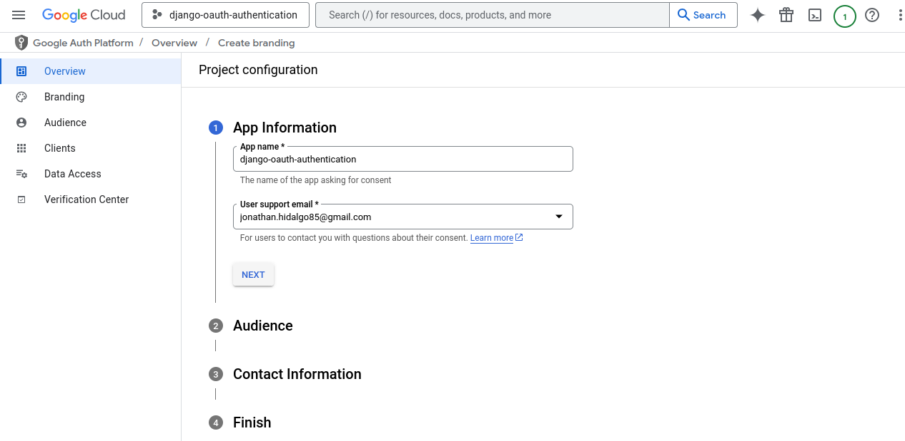

   - In the **Audience** section, select **Internal** or **External** depending on your particular case.

   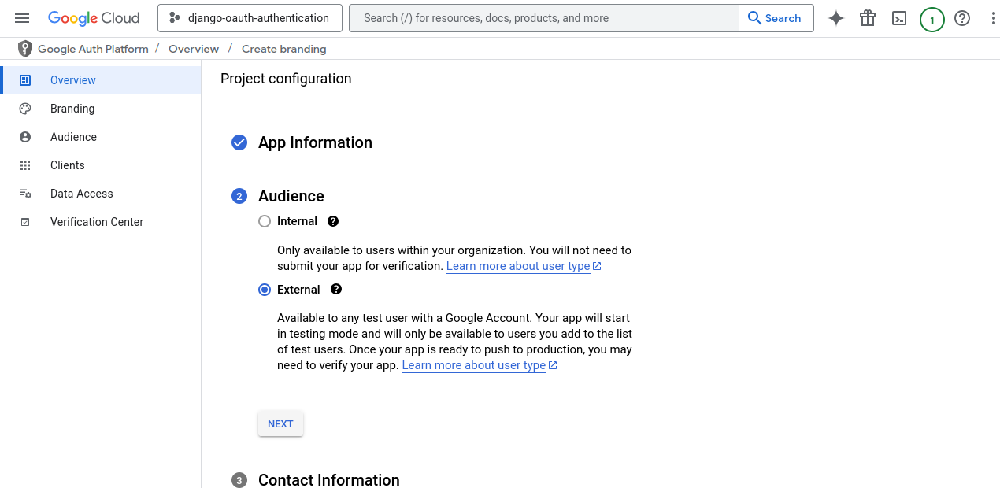


   - Add **Contact Info**:

   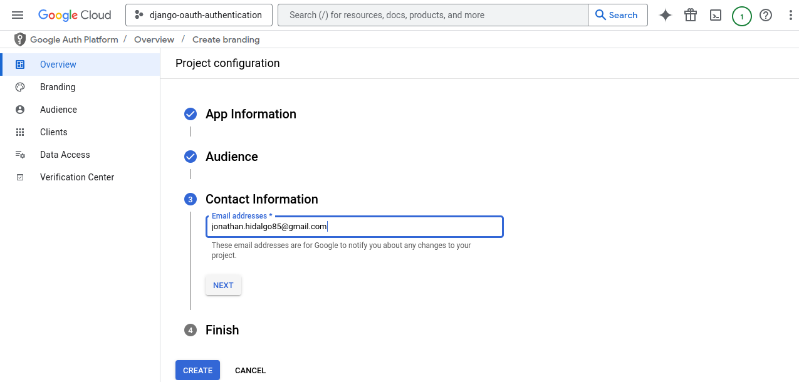

   - Please, **agree** the Google API Services: User Data Policy and click on **Create**.

   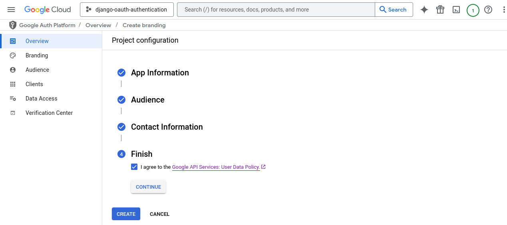


   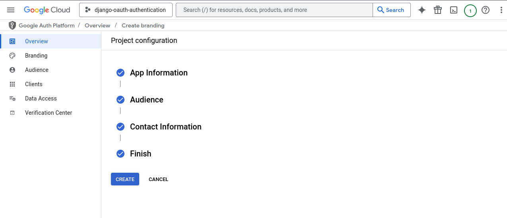


   - In the **Authorized redirect URIs** field, add the following:
     ```
     http://localhost:8000/complete/google/
     ```
   - Click **Create**.
   - After the credentials are created, note the **Client ID** and **Client Secret** displayed.

4. **Add the credentials to your `settings.py`:**
   - In your Django project, open the `settings.py` file.
   - Add the following configurations to connect your Django project with Google OAuth:

   ```python
   SOCIAL_AUTH_GOOGLE_OAUTH2_KEY = 'your-client-id'
   SOCIAL_AUTH_GOOGLE_OAUTH2_SECRET = 'your-client-secret'
   ```
Replace `'your-client-id'` and `'your-client-secret'` with the actual values you got from the Google Developer Console.


## Run the Application

1. Apply database migrations:

   ```bash
   python manage.py migrate
   ```

2. Start the development server:

   ```bash
   python manage.py runserver
   ```

3. Visit `http://localhost:8000/auth/login/google/` to log in with your Google account.

## Files Structure

- `oauth_project/`: The main project directory containing settings and URLs.
- `home.html`: A simple template that welcomes logged-in users.
- `requirements.txt`: A file containing all the required dependencies (`Django`, `social-auth-app-django`, etc.)

## How OAuth Works

OAuth allows users to authenticate into your Django application using their Google account without sharing their password. After the user grants permission, a token is provided to authenticate them on subsequent requests.

For more information, refer to OAuth 2.0 documentation.

## License

This project is licensed under the MIT License - see the LICENSE file for details.